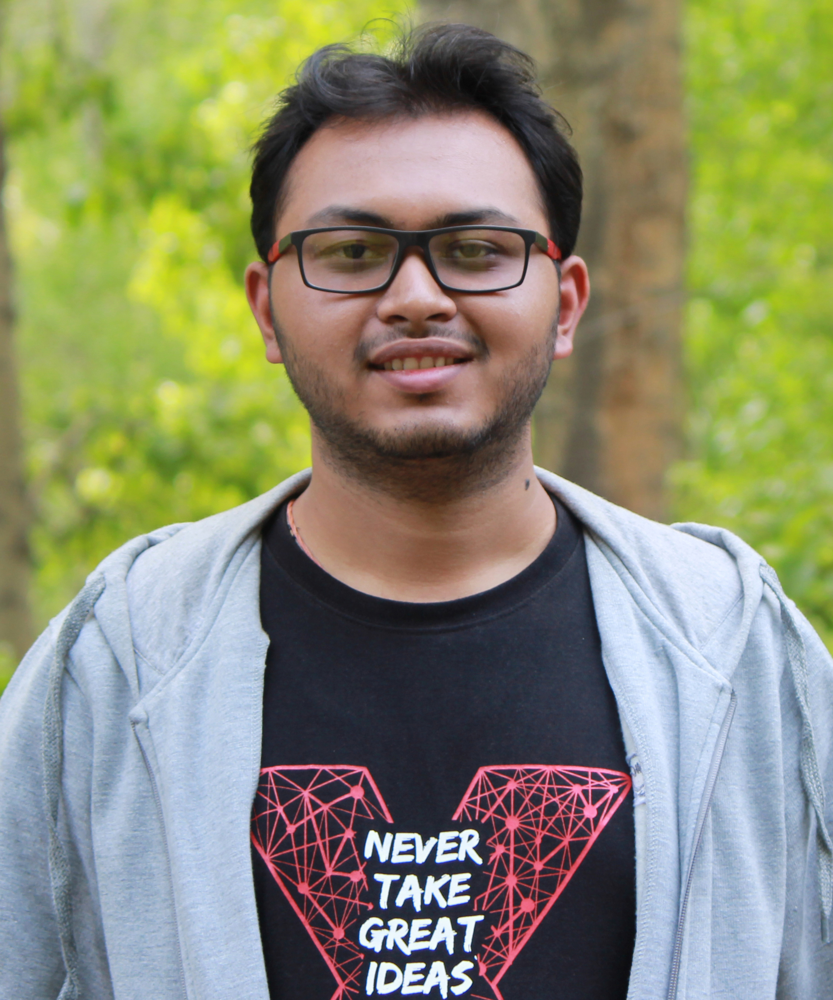

{: .aboutImage}

  

## Devansh Dhrafani

I am a fourth-year Masters student at BITS Pilani, Hyderabad Campus pursuing an integrated dual degree in M.Sc. Physics 
and B.E. Mechanical Engineering (minor in Robotics and Automation). I am extremely passionate 
about building robots and programming them to move and interact with the world.
{: .text-justify}

[CV](https://drive.google.com/file/d/1kQGqNtWd-E68a7_NmAyvFbpLSGumFxVa/view?usp=sharing){: .btn .btn--primary}

