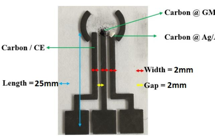

  

{: .rightAllign}
## SLAM and Autonomous Navigation of Differential Drive robot

ROS package that implements SLAM on a 2 wheeled differential drive robot to map an unknown environment. A joystick is used to teleoperate the robot which is simulated in the Gazebo environment. The map generated is then used for autonomous navigation using the ROS Navigation stack. 
{: .text-justify}

[View Project](https://github.com/devanshdhrafani/diff_drive_bot){: .btn .btn--inverse target="_blank"}

  

{: .leftAllign}
## ALFA - APTRI Labs Floor Assistant 

Summer internship at APTRI - Adani Power, Ahmedabad. Developed ALFA - An open-source floor-assistant robot, that can be controlled over the internet. Designed CAD Model, fabricated, and tested the robot. Worked on industrial delta-type 3D Printer for fabrication of Motor Mounts, Support rods and other mounts. 
{: .text-justify}

[View Project](https://github.com/YugAjmera/ALFA){: .btn .btn--inverse target="_blank"}

  

{: .humanoid}
## Dextroid -The Humanoid 

Dextroid is BITS Pilani, Hyderabad Campus's humanoid project aimed at quick developement with low resources. It has 8 DOFs for the Bipedal walk. Designed the CAD model and wrote the walking algorithm for the robot.
{: .text-justify}

[View Project](https://technopediabphc.wordpress.com/2017/04/18/the-bipedhumanoid-project-prototype-3/){: .btn .btn--inverse target="_blank"}

  
  

{: .volteraImg}
## Microfluidic Electrochemical Sensor using 3D ink extrution PCB printer

5 month research project at MEMS Lab, BITS Pilani, Hyderabad Campus under the supervision of Dr. Satish K Dubey and Mr J Murli Mohan. Developed a novel method for fabrication of PoC Electrochemical Sensor. The project explored the use of a 3D ink extrution PCB printer to print conductive carbon ink on glass substrate to create a low cost, portable electrochemical sensor for detection of various analytes. 
{: .text-justify}

[View Project](https://drive.google.com/file/d/1bafLemPgnb8VGFxrK0f75SG60DnSqTyA/view?usp=sharing){: .btn .btn--inverse target="_blank"}

## <ins>Other Projects</ins>

- HeatBuzzer: A temperature measurement and thresholding device for liquids. [Link](https://github.com/devanshdhrafani/HeatBuzzer){: target="_blank"}
- Burglar Detector with IFTTT: Device that detects intruders and alerts users with an IFTTT notification. [Link](https://github.com/devanshdhrafani/Burglar-Detector-with-IFTTT){: target="_blank"}