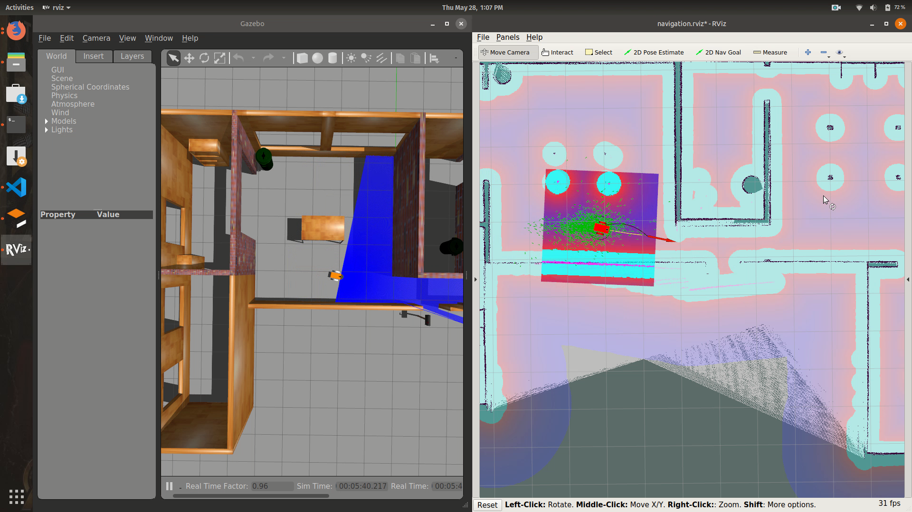
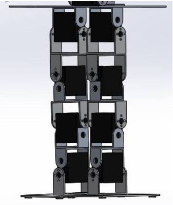

  

{: .rightAllign}
## SLAM and Autonomous Navigation of Differential Drive robot

ROS package that implements SLAM on a 2 wheeled differential drive robot to map an unknown environment. A joystick is used to teleoperate the robot which is simulated in the Gazebo environment. The map generated is then used for autonomous navigation using the ROS Navigation stack. 
{: .text-justify}

[View Project](https://github.com/YugAjmera/ALFA){: .btn .btn--inverse}

  

{: .leftAllign}
## ALFA - APTRI Labs Floor Assistant 

Summer internship at APTRI - Adani Power, Ahmedabad. Developed ALFA - An open-source floor-assistant robot, that can be controlled over the internet. Designed CAD Model, fabricated, and tested the robot. Worked on industrial delta-type 3D Printer for fabrication of Motor Mounts, Support rods and other mounts. 
{: .text-justify}

[View Project](https://github.com/YugAjmera/ALFA){: .btn .btn--inverse}

  

{: .humanoid}
## Dextroid -The Humanoid 

Dextroid is BITS Pilani, Hyderabad Campus's humanoid project aimed at quick developement with low resources. It has 8 DOFs for the Bipedal walk. Designed the CAD model and wrote the walking algorithm for the robot.
{: .text-justify}

[View Project](https://technopediabphc.wordpress.com/2017/04/18/the-bipedhumanoid-project-prototype-3/){: .btn .btn--inverse}

